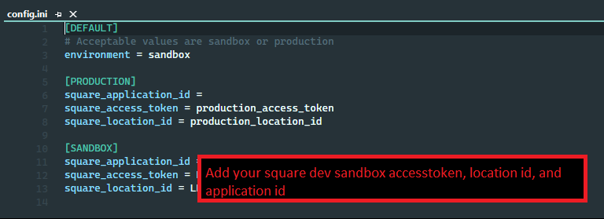
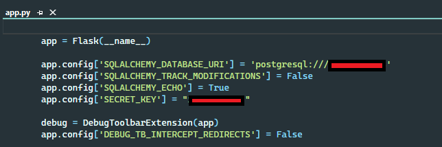
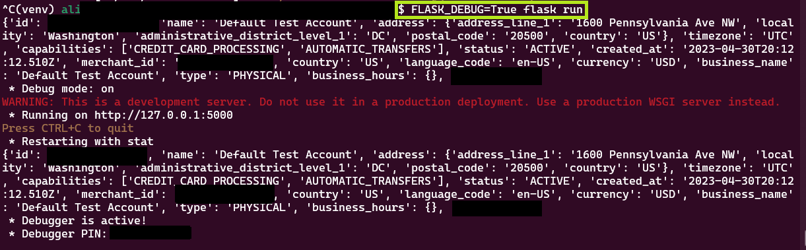

<!-- Improved compatibility of back to top link: See: https://github.com/othneildrew/Best-README-Template/pull/73 -->
<a name="readme-top"></a>
<!--
*** Thanks for checking out the Best-README-Template. If you have a suggestion
*** that would make this better, please fork the repo and create a pull request
*** or simply open an issue with the tag "enhancement".
*** Don't forget to give the project a star!
*** Thanks again! Now go create something AMAZING! :D
-->


<!-- PROJECT SHIELDS -->
<!--
*** I'm using markdown "reference style" links for readability.
*** Reference links are enclosed in brackets [ ] instead of parentheses ( ).
*** See the bottom of this document for the declaration of the reference variables
*** for contributors-url, forks-url, etc. This is an optional, concise syntax you may use.
*** https://www.markdownguide.org/basic-syntax/#reference-style-links
-->
[![Contributors][contributors-shield]][contributors-url]
[![Forks][forks-shield]][forks-url]
[![Stargazers][stars-shield]][stars-url]
[![Issues][issues-shield]][issues-url]
[![MIT License][license-shield]][license-url]
[![LinkedIn][linkedin-shield]][linkedin-url]


<!-- PROJECT LOGO -->
<br />
<div align="center">
  <!--<a href="https://github.com/othneildrew/Best-README-Template">
    
  </a>-->

  <a href="https://github.com/othneildrew/Best-README-Template">
    
  </a>
 

  <h3 align="center">Zentry CRM + Ecommerce Platform </h3>

  <p align="center">
    Your business' ecommerce, social media, and customer relationship management all in one package!
    <br />
    <a href="https://github.com/othneildrew/Best-README-Template"><strong>Explore the docs »</strong></a>
    <br />
    <br />
    <a href="https://github.com/othneildrew/Best-README-Template">View Demo</a>
    ·
    <a href="https://github.com/othneildrew/Best-README-Template/issues">Report Bug</a>
    ·
    <a href="https://github.com/othneildrew/Best-README-Template/issues">Request Feature</a>
  </p>
</div>


<!-- TABLE OF CONTENTS -->
<details>
  <summary>Table of Contents</summary>
  <ol>
    <li>
      <a href="#about-the-project">About The Project</a>
      <ul>
        <li><a href="#built-with">Built With</a></li>
      </ul>
    </li>
    <li>
      <a href="#getting-started">Getting Started</a>
      <ul>
        <li><a href="#prerequisites">Prerequisites</a></li>
        <li><a href="#installation">Installation</a></li>
      </ul>
    </li>
    <li><a href="#usage">Usage</a></li>
    <li><a href="#roadmap">Roadmap</a></li>
    <li><a href="#contributing">Contributing</a></li>
    <li><a href="#license">License</a></li>
    <li><a href="#contact">Contact</a></li>
    <li><a href="#acknowledgments">Acknowledgments</a></li>
  </ol>
</details>


<!-- ABOUT THE PROJECT -->
## About Zentry CRM & Budly Storefront  

[![Product Name Screen Shot][product-screenshot]](https://example.com)
[![Product Admin Screen Shot][product-screenshot-admin]](https://example.com)

This project was designed to include a fully functional ecommerce platform capable of supporting payments, shipping, an interactive social feed, and a scalable business management center via the paired back-end CRM, which I've dubbed "Zentry". In-house database creation and support achieved via postgresQL and SQLAlchemy.

Key Features of Zentry + Storefront:
* Fully customizable storefront that can be tailored to any business
* RESTful API for Zentry users, products, invoices, and reports
* Payments resolved with credit/debit cards, ApplePay, GooglePay, or ACH via Square
* Dynamic shop with an interactive social feed for users to discuss purchases, leave reviews, or just share content
* Back-end admin dashboard includes dynamically generated accounting data, invoices, order-details, and annual financial reports
* Activity on your site is logged in real time and displays in your Zentry dashboard! :smile:

Of course, business needs vary wildly from client to client. So I'll be adding more features in the near future! You may also suggest changes by forking this repo and creating a pull request or opening an issue. Thanks to all the people have mentored me, and to those who may make future contributions to expanding this project!

Use this `README.md` to get started!

<p align="right">(<a href="#readme-top">back to top</a>)</p>


### Built With

This section lists the major frameworks/libraries used to create Zentry. Add-ons/plugins are listed in the acknowledgements section. Without these free resources, this project would not be possible!

* <a href="https://flask.palletsprojects.com/en/2.3.x/">
    
  </a>
  
* <a href="https://flask.palletsprojects.com/en/2.3.x/">
    
  </a>
  


* <a href="https://flask-sqlalchemy.palletsprojects.com/en/3.0.x/">
    
  </a>

* <a href="https://flask.palletsprojects.com/en/2.3.x/">
    
  </a>
  
* <a href="https://flask-sqlalchemy.palletsprojects.com/en/3.0.x/"> 
    
  </a>
      | postgreSQL |
      
* <a href="https://flask-sqlalchemy.palletsprojects.com/en/3.0.x/"> 
    
  </a> 
      

* [![Bootstrap][Bootstrap.com]][Bootstrap-url]
* [![JQuery][JQuery.com]][JQuery-url]


<p align="right">(<a href="#readme-top">back to top</a>)</p>


<!-- GETTING STARTED -->
## Getting Started

To set up this project locally, you'll need a few things!
It's time to get a local copy up and running, so follow these simple steps:

### Prerequisites

You'll need this software if you don't have it already. Here is how to install them!
* [Install Python3.11](https://www.python.org/downloads/)
* [Install pip 23.1.2](https://pip.pypa.io/en/stable/installation/)
* [Install postgreSQL](https://www.postgresql.org/download/)


### Installation

_Below is a step-by-step guide of how you can install and set up this app!_

1. Get a free API Key for the Square Payments Developer Sandbox at [Square](https://developer.squareup.com/docs/devtools/sandbox/overview). You'll need to create an account.
2. Clone this repository
   ```sh
   $ git clone https://github.com/your_username_/Project-Name.git
   ```
3. Create a virtual environment to run Zentry
   ```sh
   $ python3.11 -m venv venv
   ```

   ```sh
   $ source venv/bin/activate
   ```
   * You should now see (venv) at the beginning of your command line, indicating you are running your virtual environment.
   
   ```sh
   (venv) USER@NAME:~/YOUR/PATH/CLONED-REPO $ 
   ```

   You can now install dependencies.
4. Install dependencies in the root directory of the cloned repository on your local machine
   ```sh
   (venv) $ pip install -r requirements.txt
   ```
5. Enter your Square payment API details in `config.ini`
  * (**Only if you wish to use live payment feature. Otherwise you can skip this step.**)
   ```
   [SANDBOX]

   square_application_id = [YOUR INFO HERE]
   square_access_token = [YOUR INFO HERE]
   square_location_id = [YOUR INFO HERE]
   ```
  * If you're launching your payments feature/app to production, use these config options instead.
   ```
   [PRODUCTION]

   square_application_id = 
   square_access_token = [YOUR INFO HERE]
   square_location_id = [YOUR INFO HERE]
   ```
  * Specify your environment: 
    * sandbox (demo)
    * production (live)
   
   ```
   [DEFAULT]
   
   # Acceptable values are sandbox or production
   environment = sandbox 
   ```
   <a href="#">
    
  </a>

6. Set up your database of products, users, and transaction information! 
 >The provided seed file `seed.py` will generate over 100 products, over 300 users, and a year's worth of accounting data. You can skip this step if you're planning on integrating an established database of your own design.
   
   * Check if postgresql ports are active 
   ```sh
   $ sudo service postgresql status
   ```
   * If response is not: "10/main (port XXXX): online" start local postgresql ports w/ following command:
   ```sh
   $ sudo service postgresql start
   ```
   * Create database in commandline using postgresql shell
   ```sh
   $ createdb YOUR_DB_NAME
   ```
   * Run `seed.py` to initialize the Budly database!
   * Change the database connection in `app.py` to your newly created database
   * Add your own 'SECRET_KEY'

  <a href="#">
    
  </a>
<p align="right">(<a href="#readme-top">back to top</a>)</p>

7. Run Zentry locally using Flask!
   * If you'd like to see the debug toolbar (gives you access to session variables, request variables, HTTP Headers, Logs, etc in a collapseable side-bar)
   ```sh
   (venv)$ FLASK_DEBUG=True flask run
   ```
  <a href="#">
    
  </a>

   * If you'd like run the application as a regular would see it, use the following command instead:
   ```sh
   (venv)$ FLASK_DEBUG=False flask run
   ```

<!-- USAGE EXAMPLES -->
## Usage

Use this space to show useful examples of how a project can be used. Additional screenshots, code examples and demos work well in this space. You may also link to more resources.

_For more examples, please refer to the [Documentation](https://example.com)_

<p align="right">(<a href="#readme-top">back to top</a>)</p>


<!-- ROADMAP -->
## Roadmap

- [x] Added Automatic Invoice Generation
- [x] Added CC, GooglePay, ApplePay, ACH payments support
- [ ] Automatically record accounting transactions in Zentry when purchases are completed via storefront
    - [x] revenue vs expenses automatically generated in zentry dashboard
    - [x] financial report automatcially generated (balance sheet) 
    - [x] revenue performance by sector, product, and season analysis
- [x] Social media platform integration where all users "chatters" can be seen, sorted by timestamp
    - [x] followers users' list
    - [x] following users' list
    - [x] liked chatter feed
    - [x] new chatter feed
    - [x] followed users' chatter feed

- [ ] Add Additional pages (FAQ, Landing page)
- [ ] Add Blog Section - Users can make longer blog posts instead of char limited msgs/reviews
- [ ] Add Email template for order success, password reset, etc 
- [ ] Add Bug Reports Module
- [ ] Add "charts" section to easily generate new apexcharts based on selected criteria
- [ ] Add ability to sort products by rating
- [ ] Add ability update profile credentials
- [ ] Multi-language Support
    - [ ] French
    - [ ] Spanish

See the [open issues](https://github.com/othneildrew/Best-README-Template/issues) for a full list of proposed features (and known issues).

<p align="right">(<a href="#readme-top">back to top</a>)</p>


<!-- CONTRIBUTING -->
## Contributing

Contributions are what make the open source community such an amazing place to learn, inspire, and create. Any contributions you make are **greatly appreciated**.

If you have a suggestion that would make this better, please fork the repo and create a pull request. You can also simply open an issue with the tag "enhancement".
Don't forget to give the project a star! Thanks again!

1. Fork the Project
2. Create your Feature Branch (`git checkout -b feature/AmazingFeature`)
3. Commit your Changes (`git commit -m 'Add some AmazingFeature'`)
4. Push to the Branch (`git push origin feature/AmazingFeature`)
5. Open a Pull Request

<p align="right">(<a href="#readme-top">back to top</a>)</p>


<!-- LICENSE -->
## License

Distributed under the MIT License. See `LICENSE.txt` for more information.

<p align="right">(<a href="#readme-top">back to top</a>)</p>


<!-- CONTACT -->
## Contact

Your Name - [@your_twitter](https://twitter.com/your_username) - email@example.com

Project Link: [https://github.com/your_username/repo_name](https://github.com/your_username/repo_name)

<p align="right">(<a href="#readme-top">back to top</a>)</p>


<!-- ACKNOWLEDGMENTS -->
## Acknowledgments

Use this space to list resources you find helpful and would like to give credit to. I've included a few of my favorites to kick things off!

* [Choose an Open Source License](https://choosealicense.com)
* [GitHub Emoji Cheat Sheet](https://www.webpagefx.com/tools/emoji-cheat-sheet)
* [Malven's Flexbox Cheatsheet](https://flexbox.malven.co/)
* [Malven's Grid Cheatsheet](https://grid.malven.co/)
* [Img Shields](https://shields.io)
* [GitHub Pages](https://pages.github.com)
* [Font Awesome](https://fontawesome.com)
* [React Icons](https://react-icons.github.io/react-icons/search)

<p align="right">(<a href="#readme-top">back to top</a>)</p>


<!-- MARKDOWN LINKS & IMAGES -->
<!-- https://www.markdownguide.org/basic-syntax/#reference-style-links -->
[contributors-shield]: https://img.shields.io/github/contributors/othneildrew/Best-README-Template.svg?style=for-the-badge
[contributors-url]: https://github.com/othneildrew/Best-README-Template/graphs/contributors
[forks-shield]: https://img.shields.io/github/forks/othneildrew/Best-README-Template.svg?style=for-the-badge
[forks-url]: https://github.com/othneildrew/Best-README-Template/network/members
[stars-shield]: https://img.shields.io/github/stars/othneildrew/Best-README-Template.svg?style=for-the-badge
[stars-url]: https://github.com/othneildrew/Best-README-Template/stargazers
[issues-shield]: https://img.shields.io/github/issues/othneildrew/Best-README-Template.svg?style=for-the-badge
[issues-url]: https://github.com/othneildrew/Best-README-Template/issues
[license-shield]: https://img.shields.io/github/license/othneildrew/Best-README-Template.svg?style=for-the-badge
[license-url]: https://github.com/othneildrew/Best-README-Template/blob/master/LICENSE.txt
[linkedin-shield]: https://img.shields.io/badge/-LinkedIn-black.svg?style=for-the-badge&logo=linkedin&colorB=555
[linkedin-url]: https://linkedin.com/in/othneildrew
[product-screenshot]: static/images/readme/shop-mock-laptop.png
[product-screenshot-admin]: static/images/readme/admin-mock-laptop.png
[product-screenshot-cart]: static/images/mockuper(5).png
[Next.js]: https://img.shields.io/badge/next.js-000000?style=for-the-badge&logo=nextdotjs&logoColor=white
[Next-url]: https://nextjs.org/
[React.js]: https://img.shields.io/badge/React-20232A?style=for-the-badge&logo=react&logoColor=61DAFB
[React-url]: https://reactjs.org/
[Vue.js]: https://img.shields.io/badge/Vue.js-35495E?style=for-the-badge&logo=vuedotjs&logoColor=4FC08D
[Vue-url]: https://vuejs.org/
[Angular.io]: https://img.shields.io/badge/Angular-DD0031?style=for-the-badge&logo=angular&logoColor=white
[Angular-url]: https://angular.io/
[Svelte.dev]: https://img.shields.io/badge/Svelte-4A4A55?style=for-the-badge&logo=svelte&logoColor=FF3E00
[Svelte-url]: https://svelte.dev/
[Laravel.com]: https://img.shields.io/badge/Laravel-FF2D20?style=for-the-badge&logo=laravel&logoColor=white
[Laravel-url]: https://laravel.com
[Bootstrap.com]: https://img.shields.io/badge/Bootstrap-563D7C?style=for-the-badge&logo=bootstrap&logoColor=white
[Bootstrap-url]: https://getbootstrap.com
[JQuery.com]: https://img.shields.io/badge/jQuery-0769AD?style=for-the-badge&logo=jquery&logoColor=white
[JQuery-url]: https://jquery.com 